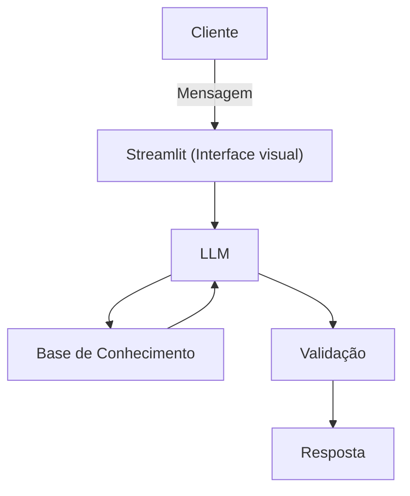

# 💸 Ju — Especialista em Inteligência Financeira
Ju é uma assistente virtual conversacional desenvolvida com IA Generativa para ajudar pessoas iniciantes a organizarem suas finanças, planejarem metas e entenderem investimentos de forma simples e acessível.

# 🎯 Problema que resolve
Muitas pessoas recebem seu salário mas não conseguem visualizar para onde o dinheiro vai, nem transformar objetivos como reserva de emergência, entrada de imóvel ou viagem internacional em planos concretos. A Ju resolve isso de forma didática, sem julgamentos e com linguagem acessível.

# 🤖 Sobre o Agente
Atributo Descrição
Nome:    Ju        


# 🗂️ Estrutura do Projeto
```
│
├── app.py                            # Aplicação principal (Streamlit + Ollama)
│
├── 📁 data/
│   ├── historico_atendimento.csv     # Histórico de atendimentos da Ju com o cliente
│   ├── perfil_cliente.json           # Perfil, metas e situação financeira do cliente
│   ├── tipos_investimentos.json      # Catálogo de produtos financeiros disponíveis
│   └── transacoes.csv                # Transações mensais de receitas e despesas
│
└── 📁 docs/
    ├── 01-documentacao-agente.md     # Caso de uso, persona e arquitetura
    ├── 02-base-conhecimento.md       # Estratégia de dados e integração
    ├── 03-prompts.md                 # System prompt, exemplos e edge cases
    ├── 04-metricas.md                # Métricas de avaliação e testes
    └── 05-pitch.md                   # Roteiro do pitch de apresentação
```
## Arquitetura

### Diagrama



### Componentes

| Componente | Descrição |
|------------|-----------|
| Interface | [Steamlit](https://streamlit.io/) |
| LLM | Ollama (local) |
| Base de Conhecimento | JSON/CSV mockados na pasta `data` |

---


# ▶️ Como rodar
Pré-requisitos: Python 3.10+, Ollama rodando localmente.
bash# Instale as dependências
pip install streamlit pandas requests

# Suba o modelo no Ollama
```bash
# Baixe o modelo
ollama pull gpt-oss:20b-cloud

# Inicie o servidor Ollama
ollama serve
```

# Rode a aplicação
```bash
streamlit run app.py
```

# 🧠 Como funciona
A Ju carrega automaticamente os dados do cliente ao iniciar e os injeta no prompt como contexto. A partir daí, responde perguntas com base em:

Perfil e metas do cliente (perfil_cliente.json)
Gastos e receitas recentes (transacoes.csv)
Histórico de conversas anteriores (historico_atendimento.csv)
Catálogo de investimentos compatíveis com o perfil (tipos_investimentos.json)


# 🔒 Segurança e Limitações

Não solicita nem armazena dados sensíveis (senhas, e-mails etc.)
Não inventa informações — admite quando não sabe algo
Não realiza investimentos autonomamente
Não substitui um profissional financeiro certificado
Recomenda investimentos apenas alinhados ao perfil do cliente (ex: conservador → sem cripto ou ações)

