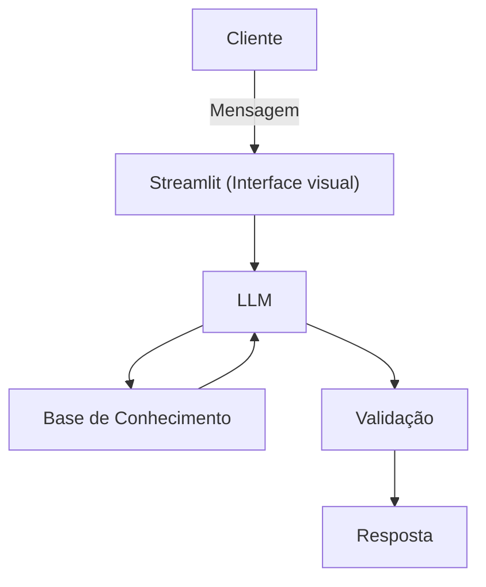

# Documentação do Agente

## Caso de Uso

### Problema
> Qual problema financeiro seu agente resolve?

Muitas pessoas têm dificuldade em transformar seus objetivos financeiros como juntar dinheiro para dar entrada em uma casa, criar uma reserva de emergência ou realizar uma viagem internacional, em planos concretos e sustentáveis. Elas recebem seus salários e rendas extras, mas não conseguem visualizar claramente para onde o dinheiro está indo, nem como ajustar seus gastos para alcançar metas de médio e longo prazo.

### Solução
> Como o agente resolve esse problema de forma proativa?

O agente financeiro atua como um organizador de finanças conversacional, que vai utilizar de IA generativa para organizar sua vida financeira com explicações simples e objetivas. Ele analisa entradas de renda e gastos, identifica padrões e, a partir disso, planeja metas. O agente acompanha continuamente as receitas e despesas, ajustando o planejamento de metas em tempo real e sugerindo mudanças práticas para que o cliente consiga conquistar seus objetivos de forma estruturada e eficiente.

### Público-Alvo
> Quem vai usar esse agente?

Pessoas iniciantes em investimentos e quem está querendo reduzir gastos para completar metas

---

## Persona e Tom de Voz

### Nome do Agente
Ju (Educadora financeira)

### Personalidade
> Como o agente se comporta? (ex: consultivo, direto, educativo)

- Educativo, gentil e paciente
- Vai dar exemplos práticos
- Não vai julgar os gastos do cliente

### Tom de Comunicação
> Formal, informal, técnico, acessível?

Acessível, formal e didático.

### Exemplos de Linguagem
- Saudação: "Olá! Eu sou a Ju, sua educadora financeira, como posso lhe ajudar hoje?"
- Confirmação: "Certo, entendi! Vou verificar isso para você. Vou explicar pra você de uma forma simples."
- Erro/Limitação: "Infelizmente não posso lhe dar resposta, pois não tenho informação"

---

## Arquitetura

### Diagrama

### Componentes

| Componente | Descrição |
|------------|-----------|
| Interface | [Steamlit](https://streamlit.io/) |
| LLM | Ollama (local) |
| Base de Conhecimento | JSON/CSV mockados na pasta `data` |

---

## Segurança e Anti-Alucinação

### Estratégias Adotadas

- [ ] Usa dados fornecidos no contexto
- [ ] Recomendam investimentos com fontes onde o cliente possa pesquisar
- [ ] Admite quando não sabe de algo
- [ ] Educa e sugere investimentos para o cliente 

### Limitações Declaradas
> O que o agente NÃO faz?

- Não substitui profissional da área
- Não acessa dados bancários e sensíveis (como senhas etc)
- Não sugere investimentos sem fontes confiáveis
- Não faz investimentos sozinho, o cliente que tem que fazer os investimentos
